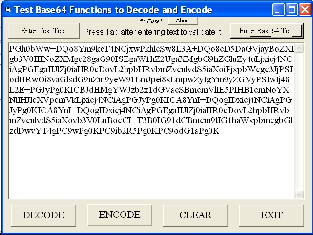



## Base64 Encode and Decode

### Description

Encode and Decode base64 strings to/from regular text strings
 
### More Info
 
regular text or base64 text

You need know that you want base64 text coded or decoded

             |
---                |---
**Submitted On**   |2003-12-28 01:30:40
**By**             |[Ron Pitts](https://github.com/Planet-Source-Code/PSCIndex/blob/master/ByAuthor/ron-pitts.md)
**Level**          |Intermediate
**User Rating**    |4.8 (38 globes from 8 users)
**Compatibility**  |VB 6\.0
**Category**       |[Internet/ HTML](https://github.com/Planet-Source-Code/PSCIndex/blob/master/ByCategory/internet-html__1-34.md)
**World**          |[Visual Basic](https://github.com/Planet-Source-Code/PSCIndex/blob/master/ByWorld/visual-basic.md)
**Archive File**   |[Base64\_Enc16873212282003\.zip](https://github.com/Planet-Source-Code/ron-pitts-base64-encode-and-decode__1-50634/archive/master.zip)

### API Declarations

none, it's all string manipulation

